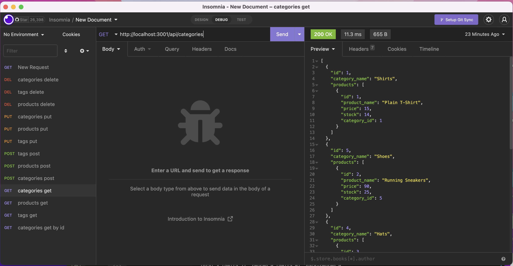

# E-Commerce

## Description
This server-side application demonstrates the ability to build routes and connect to sequelize database models.

There is no client-side user interface, it is only to demonstrate the ability build and use HTTP methods: GET, POST, UPDATE, DELETE and connect with the database using ORM.
A video link has been provide below showing the use of Imsomnia to test all the HTTP methods as discussed.

gitHub repo URL: https://github.com/Tomal1/E-Commerce

Youtube video URL: https://www.youtube.com/watch?v=awNaLkcgKsQ

## Usage
The user can use Imsomnia to test out the HTTP mettods as demonstrated in the video link found above.

## License

Please refer to the LICENSE in the repo.

